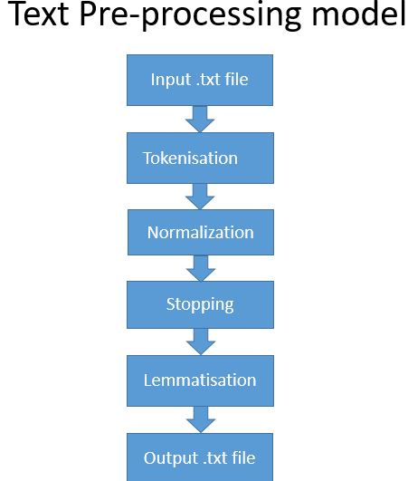

# MCQ Bot

This is the dataset of networking based books
The file source4 is the one that we want to modify
Remove all unnecessary stuff from it .
Make the entire file as a single paragraph.

Also make sure the modified file at each stage is in ansi encoding

Added notes about possible architecture to model_architecture.txt

Furthermore the question bank is added, the number of questions in each file indicated by the title of the file

## Updates

Create an updates folder and post daily updates on it. All of us put in lines about daily contributions
Add neccecary txt files

## Research papers 
<a href="/docs/papers/Using-Vector-Space-Model-in-Question-Answering-S_2015_Procedia-Computer-Scie.pdf">Using Vector Space Model in Question Answering System</a> </br>
<a href="/docs/papers/dlqa.pdf">Deep Learning Models For Question Answering</a>

## Requirements

### Software 
 ```
 1. Tensorflow - 1.8 or higher
 2. Keras - 2.0.6 
 3. Jupyter notebook
 4. matplotlib
 5. seaborn
 6. nltk
 7. gensim
 ``` 
### Hardware

 If using ```tensorflow-gpu``` a graphics card is needed
## Word embeddings

To be added by rahul

## Text Pre-Processing

 We Preprocess the dataset to remove the unnecessary data like stopwords and perform Tokenization to increase the efficiency
 
 
 

## Running the model

Go to the exam-bot-ccna directory, then run the following files:

1. flashcard-embedding.ipynb
2. qa-blstm-fem-attn.ipynb

Parts of code adapted from open source online resources

## Current Model


### QA-LSTM with Attention

RNN's in the model are improved using LSTM and GRU units


Image adapted from online resources 

